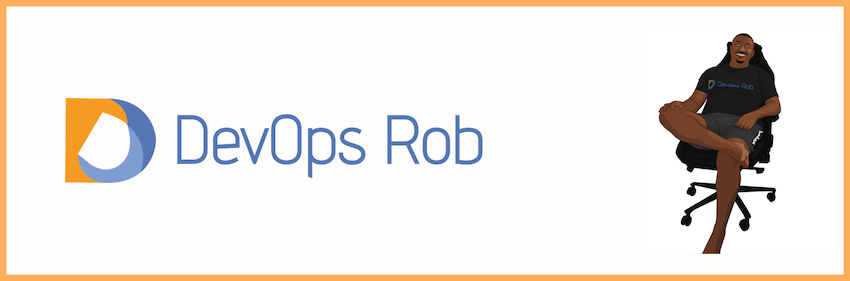

### About me
I'm a HashiCorp Ambassador (2020).  Currently working as a Senior Developer Advocate at   residing in UK 🇬🇧. I'm a Frequent speaker 🗣 and a public learner 📝.

### Fun facts

- Music lover 🎵 🎶
- Fast Car enthusiast 🏎
- Foodie 🍲
- Cognac connoisseur 🥃

## ✍🏿 Blog ✍🏿
I write a lot of blog articles, some of which can be found [here](https://www.devopsrob.com/resources/).  I talk a lot about Vault and security in the Software Development Lifecycle.
<!--
**devops-rob/devops-rob** is a ✨ _special_ ✨ repository because its `README.md` (this file) appears on your GitHub profile.

Here are some ideas to get you started:

- 🔭 I’m currently working on ...
- 🌱 I’m currently learning ...
- 👯 I’m looking to collaborate on ...
- 🤔 I’m looking for help with ...
- 💬 Ask me about ...
- 📫 How to reach me: ...
- 😄 Pronouns: ...
- ⚡ Fun fact: ...
-->
